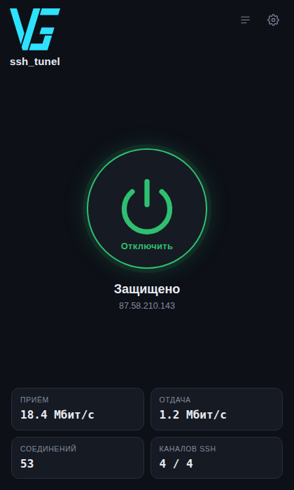

<div align="center">

# ssh_tunnel

**Routes application traffic through your own Linux server over plain SSH.**

A single file. No installer, no administrator rights.
An educational project: it shows how a working local proxy is built out of a
standard SSH mechanism.

[](LICENSE)
[](https://github.com/VITAZGIO/ssh_tunel/releases)
[](https://github.com/VITAZGIO/ssh_tunel/releases/latest)
[](https://github.com/VITAZGIO/ssh_tunel/releases/latest)
[](https://github.com/VITAZGIO/ssh_tunel/releases/latest)
[](src)

[🇷🇺 Русский](README.md) · 🇬🇧 English

### Download

| System | File | |
|---|---|---|
| **Windows** | [**ssh_tunnel.exe**](https://github.com/VITAZGIO/ssh_tunel/releases/latest/download/ssh_tunnel.exe) | window with a button, tray icon |
| **Linux** | [**ssh_tunnel_linux**](https://github.com/VITAZGIO/ssh_tunel/releases/latest/download/ssh_tunnel_linux) | console + web interface, systemd service — [commands for your distro](#commands-for-your-distribution) |
| **Android** | [**ssh_tunnel.apk**](https://github.com/VITAZGIO/ssh_tunel/releases/latest/download/ssh_tunnel.apk) | VPN connection, quick-settings tile |

The ARM build and the checksums are on the
[release page](https://github.com/VITAZGIO/ssh_tunel/releases/latest).

Setting up a **new VPS** to be the server — that's not a file to download but a
sequence of steps: [first-time server setup](docs/SERVER_SETUP.md) — keys,
firewall, a dedicated `tunnel` user.




</div>

---

## What this is

SSH has a standard feature — forwarding TCP connections (`direct-tcpip`, the
same thing `ssh -D` does). `ssh_tunnel` opens an SSH connection to **your** server
and runs a local proxy on top of it: an application talks to a proxy on its own
machine, and the connection to the destination is opened by the server.

Where that is useful: seeing how a service answers from your server's address,
reaching an internal network you already work in over SSH, debugging how an
application behaves through a proxy, giving a program a stable outgoing address.

No third-party servers, no subscriptions, no accounts: all you need is a server
you can log into over SSH.

The project was written for educational purposes — to work out how SOCKS, HTTP
CONNECT, SSH channels and socket-to-process lookup are put together. How you use
it, and whether that agrees with the rules of your provider, of the services you
reach, and with your local law, is your responsibility.

### Key features

- 🔌 **Three protocols at once** — SOCKS5, SOCKS4/4a and HTTP CONNECT. Different
  programs speak different things, and all three are needed.
- 🎯 **Per-application split tunnelling** — everything goes through the tunnel,
  or only the applications you pick, or everything except them. Rules apply on
  the fly, without reconnecting.
- 🏠 **Your LAN stays reachable** — the router, a NAS, Home Assistant and
  anything else on `192.168.x.x` or reachable by a local name goes direct
  instead of through the server. Mesh VPNs (NetBird, Tailscale) too: their
  `100.64.x.x` addresses are covered. Other networks go in your own
  always-direct list.
- 🧩 **Works where the system proxy cannot** — Node.js, Python, Go and everything
  built on them (Claude Code, npm, pip, curl) read only environment variables,
  and the program sets them.
- ♻️ **Survives dropped links** — a pool of SSH connections with liveness checks
  and automatic reconnect. A laptop waking from sleep does not break the tunnel.
- 🛟 **Restores your settings on any exit**, including a crash: the internet does
  not disappear after you quit.
- 🔑 **Verifies the server key** — a man-in-the-middle swapping the server out
  will not pass unnoticed.
- 📈 **Measures the real throughput** — a multi-stream speed test through the
  tunnel.
- 👀 **Shows who is going online** — a live list of programs and addresses, with
  a mark when a DNS lookup went around the tunnel.
- 📱 **Android app** — a system-level VPN connection, no per-app proxy setup
  needed.

> A detailed technical write-up is in [ARCHITECTURE.md](docs/ARCHITECTURE.md)
> (in Russian).

---

## How it works (short version)

```
  application
      │  SOCKS4/4a/5 (1080)   HTTP CONNECT (1081)
      ▼
  ssh_tunnel  ──── encrypted SSH (22) ────►  your server  ──►  network
```

1. The application thinks it is talking to an ordinary proxy on its own machine.
2. `ssh_tunnel` parses the request, learns the destination and opens a
   `direct-tcpip` channel to it over SSH.
3. Host names are resolved by the server, not by your computer: the connection
   leaves from the server's address in full, DNS lookup included.

---

## Requirements

**Your machine:**
- Windows 10 / 11, or Linux (amd64 / arm64)
- nothing else: the binary is self-contained, no runtime, no installer

**Your server:**
- any Linux server you can reach over SSH — your own box or a rented one, it
  makes no difference. Nothing has to be installed on it: the proxy runs on
  your machine, the server only passes connections through.

Freshly rented server, still stock? Turn password logins off and switch the
firewall on first — a ready-to-paste block of commands is in
[SERVER_SETUP.md](docs/SERVER_SETUP.md) (in Russian).

---

## Windows

1. Download [**ssh_tunnel.exe**](https://github.com/VITAZGIO/ssh_tunel/releases/latest/download/ssh_tunnel.exe)
   and put it in a permanent folder.
2. Run it. Windows will warn about an unknown publisher — «More info» → «Run
   anyway» (the binary is not signed with a certificate: that costs money and
   requires a legal entity).
3. Open the settings (the gear), enter the server address and the user name.
   No key yet? Click the question mark next to «Private key» — there is a
   ready-made command that creates a key and uploads it to the server.
4. Save, go back, press the round button.

The close button hides the program in the tray, the tunnel keeps running. To
quit for real: right-click the tray icon → «Exit».

If you want a console build for Windows, it is in the sources and takes one
command: `GOOS=windows go build -o ssh_tunnel_cli.exe ./cmd/ssh_tunnel_cli`.

---

## Linux

For servers and workstations, amd64 and arm64. The binary is built statically:
it needs no libraries and no particular glibc version — it runs the same on
Debian, Fedora, Arch, and even on Alpine with musl.

```bash
# download and make executable
curl -LO https://github.com/VITAZGIO/ssh_tunel/releases/latest/download/ssh_tunnel_linux
chmod +x ssh_tunnel_linux

# set the server once
./ssh_tunnel_linux -host YOUR_SERVER -user tunnel -save

# run: tunnel only...
./ssh_tunnel_linux

# ...or with the web interface
./ssh_tunnel_linux -web

# ...or with the panel open to your home network
./ssh_tunnel_linux -web -web-lan
```

### Commands for your distribution

The program itself is identical everywhere — what differs is how you install
`curl`, how you open a port in the firewall, and how a service is set up. Open
your system:

<details>
<summary><b>Ubuntu · Debian · Linux Mint · Raspberry Pi OS</b></summary>

```bash
sudo apt update && sudo apt install -y curl

curl -LO https://github.com/VITAZGIO/ssh_tunel/releases/latest/download/ssh_tunnel_linux
chmod +x ssh_tunnel_linux
sudo install -m 755 ssh_tunnel_linux /usr/local/bin/ssh_tunnel_linux

ssh_tunnel_linux -host YOUR_SERVER -user tunnel -save
ssh_tunnel_linux -web -web-lan
```

The panel opens at `http://MACHINE_ADDRESS:47821`. If ufw is on, let only your
home network in:

```bash
sudo ufw allow from 192.168.0.0/16 to any port 47821 proto tcp
```

Autostart — the "Start at system boot" checkbox in the panel itself.

On a Raspberry Pi and other ARM machines the file is named
`ssh_tunnel_linux_arm64`.
</details>

<details>
<summary><b>Proxmox VE</b></summary>

Proxmox is Debian, but you normally work there as `root` and with no user
session. So the service goes in as a **system** one rather than a user one, and
the autostart checkbox in the panel will not help here — it targets
`systemctl --user`.

```bash
apt update && apt install -y curl

curl -LO https://github.com/VITAZGIO/ssh_tunel/releases/latest/download/ssh_tunnel_linux
chmod +x ssh_tunnel_linux
install -m 755 ssh_tunnel_linux /usr/local/bin/ssh_tunnel_linux

ssh_tunnel_linux -host YOUR_SERVER -user root -save
```

The system service (starts at host boot, before any login):

```bash
tee /etc/systemd/system/ssh_tunnel.service >/dev/null <<'EOF'
[Unit]
Description=ssh_tunnel
After=network-online.target
Wants=network-online.target

[Service]
Type=simple
ExecStart=/usr/local/bin/ssh_tunnel_linux -web -web-lan
Restart=always
RestartSec=5

[Install]
WantedBy=multi-user.target
EOF

systemctl daemon-reload
systemctl enable --now ssh_tunnel
```

Settings then live in `/root/.config/ssh_tunnel/`. If the Proxmox firewall is on
(Datacenter → Firewall), port `47821` has to be allowed there, in the Proxmox web
UI — `ufw` plays no part in it.
</details>

<details>
<summary><b>Fedora · RHEL · CentOS Stream · Rocky · AlmaLinux</b></summary>

```bash
sudo dnf install -y curl

curl -LO https://github.com/VITAZGIO/ssh_tunel/releases/latest/download/ssh_tunnel_linux
chmod +x ssh_tunnel_linux
sudo install -m 755 ssh_tunnel_linux /usr/local/bin/ssh_tunnel_linux

ssh_tunnel_linux -host YOUR_SERVER -user tunnel -save
ssh_tunnel_linux -web -web-lan
```

The firewall here is `firewalld`, not `ufw`:

```bash
sudo firewall-cmd --permanent --add-port=47821/tcp
sudo firewall-cmd --reload
```

SELinux does not get in the way: the program touches neither system directories
nor other people's ports — everything of its own stays in the user's home.
</details>

<details>
<summary><b>Arch · Manjaro · EndeavourOS</b></summary>

```bash
sudo pacman -S --needed curl

curl -LO https://github.com/VITAZGIO/ssh_tunel/releases/latest/download/ssh_tunnel_linux
chmod +x ssh_tunnel_linux
sudo install -m 755 ssh_tunnel_linux /usr/local/bin/ssh_tunnel_linux

ssh_tunnel_linux -host YOUR_SERVER -user tunnel -save
ssh_tunnel_linux -web -web-lan
```

There is no firewall by default at all — if you installed one, open port `47821`
there. Everything else is as on Ubuntu, same systemd.
</details>

<details>
<summary><b>openSUSE</b></summary>

```bash
sudo zypper install -y curl

curl -LO https://github.com/VITAZGIO/ssh_tunel/releases/latest/download/ssh_tunnel_linux
chmod +x ssh_tunnel_linux
sudo install -m 755 ssh_tunnel_linux /usr/local/bin/ssh_tunnel_linux

ssh_tunnel_linux -host YOUR_SERVER -user tunnel -save
ssh_tunnel_linux -web -web-lan
```

The port is opened through `firewalld`, as on Fedora:

```bash
sudo firewall-cmd --permanent --add-port=47821/tcp && sudo firewall-cmd --reload
```
</details>

<details>
<summary><b>Alpine Linux</b></summary>

The one system on this list with **no systemd** — it runs OpenRC. The program
works fine (the binary is static, musl is no obstacle), but autostart is set up
differently, and the checkbox in the panel will not do it.

```sh
apk add curl

curl -LO https://github.com/VITAZGIO/ssh_tunel/releases/latest/download/ssh_tunnel_linux
chmod +x ssh_tunnel_linux
install -m 755 ssh_tunnel_linux /usr/local/bin/ssh_tunnel_linux

ssh_tunnel_linux -host YOUR_SERVER -user tunnel -save
```

The OpenRC service:

```sh
cat > /etc/init.d/ssh_tunnel <<'EOF'
#!/sbin/openrc-run
command="/usr/local/bin/ssh_tunnel_linux"
command_args="-web -web-lan"
command_background=true
pidfile="/run/ssh_tunnel.pid"
depend() { need net; }
EOF

chmod +x /etc/init.d/ssh_tunnel
rc-update add ssh_tunnel default
rc-service ssh_tunnel start
```
</details>

### Starting at boot

At the bottom of the settings there are two checkboxes side by side:

- **"Start at system boot"** — the program writes the systemd unit itself,
  enables it, and allows it to run without the user logging in. That last part
  needs administrator rights: if the system asks for a password, a field for it
  appears right there — the password is used once and stored nowhere.
- **"Connect immediately on launch"** — the tunnel comes up on its own as soon
  as the program starts, no need to press "Connect" in the panel. On by
  default — that's the ordinary behavior; turn it off if you'd rather start the
  tunnel by hand.

Together they give you "turn the machine on, the tunnel is already up": the
first checkbox brings the program up at boot, the second connects it right
away.

If Docker is found on the machine, a third checkbox appears a little further
down — turn on autostart for Docker too, so that after a reboot the containers
and the tunnel come up together.

This works anywhere systemd is present. The exceptions are Proxmox under `root`
and Alpine: there the service is set up by hand, with the commands above.

The web interface is the very same one the Windows build shows in its window,
served on the fixed port `47821`. The port is deliberately unusual so it does not
collide with whatever is already running on a server.

By default the panel listens on `127.0.0.1` only and the address carries an
access token, printed at startup. Nothing reaches it from the network, and no
page that happens to be open in your browser can either.

The **`-web-lan`** flag turns it into a home service like Home Assistant: fixed
address, no token, opened straight at the machine's address —

```
http://192.168.1.203:47821
```

Only your own side gets in: local network addresses (`192.168.x.x`, `10.x.x.x`,
`172.16–31.x.x`) and mesh VPNs (`100.64.x.x`). A public address still needs the
token, and the `Origin` check keeps a foreign site in the next browser tab from
pressing anything on your behalf. Anyone on that network can control the tunnel —
usually the point at home, not something to leave on in someone else's network.

Wire the proxy into the current shell (curl, git, apt, docker, pip, npm):

```bash
source ~/.config/ssh_tunnel/proxy.env
```

As a systemd service — see [packaging/linux](packaging/linux):

```bash
./packaging/linux/install.sh ./ssh_tunnel_linux --lan   # without --lan: local machine only
systemctl --user enable --now ssh_tunnel
```

---

## Android

Android 8.0 and newer. It works differently from the desktop, and deliberately
so: there is no local proxy to point apps at.

The app brings up a **VPN connection** using the system's own mechanism, pulls
raw IP packets out of it, parses them with its own network stack, and sends
them out over the same SSH connection. Apps have nothing to configure — they
just go online, and the system hands their traffic to us.

1. Download [**ssh_tunnel.apk**](https://github.com/VITAZGIO/ssh_tunel/releases/latest/download/ssh_tunnel.apk).
2. Open the file. Android will ask for permission to install from this
   source — needed once.
3. Gear icon → server address, user `tunnel`, private key. Paste the key in
   full, including the `-----BEGIN...` and `-----END...` lines. The field
   clears itself after saving — it should not stay on screen.
4. The button on the main screen. The first time, the system will ask you to
   confirm the VPN connection — that is its own prompt, not ours.

Use a **separate** key for the phone, not the same one as your computer:
losing one device then does not compromise the other.

```bash
ssh-keygen -t ed25519 -f ~/.ssh/phone -C "phone"
```

Add the public half (`phone.pub`) to
`/home/tunnel/.ssh/authorized_keys` on the server, with the same restrictions
as everything else — see [SERVER_SETUP.md](docs/SERVER_SETUP.md) (in Russian).

**What's there:** per-app selection (which apps go through the tunnel, which
do not) — the system itself handles the picker; a quick-settings tile;
connection log; speed test; latency to the server.

**What's not:** UDP. It does not pass through SSH, so calls and games that
need UDP have to be added to the exceptions and will go direct. The web and
messaging apps work fine: the app rejects UDP immediately, and they fall back
to TCP within a fraction of a second.

---

## Configuration

Settings live in `%APPDATA%\ssh_tunnel\config.json` on Windows and in
`~/.config/ssh_tunnel/config.json` on Linux. The GUI writes the same file the
flags do.

| Key | Meaning |
|---|---|
| `host` | Address of your server. |
| `sshPort` | SSH port, `22` by default. |
| `user` | User to log in as. |
| `keyPath` | Private key. Detected automatically among `id_ed25519`, `id_ecdsa`, `id_rsa`. |
| `socksPort` | Local SOCKS4/4a/5 port, `1080` by default. |
| `httpPort` | Local HTTP proxy port, `1081` by default. |
| `poolSize` | Number of parallel SSH connections. More streams — higher throughput on a long link. |
| `filterMode` | `all`, `only` or `except` — the split-tunnelling mode. |
| `filterApps` | The list of applications that mode applies to. |
| `localViaTunnel` | Whether the local network goes through the server too. `false` by default — it goes direct. |
| `directHosts` | Your own list of addresses and networks that always go direct: `100.64.0.0/10`, `10.8.*`, `.netbird.cloud`. |

Linux flags: `-host`, `-sshport`, `-user`, `-key`, `-port`, `-httpport`,
`-pool`, `-filter`, `-apps`, `-direct`, `-local-via-tunnel`, `-sysproxy`,
`-setenv`, `-save`, `-env`, `-web`, `-web-lan`, `-web-listen`, `-v`.

---

## Security

- **The server key is checked.** On the first connection its fingerprint is
  remembered (TOFU) in `known_hosts`; if it changes later, the program refuses
  to connect instead of quietly talking to whoever answered.
- **Host names are resolved on the server**, so the whole request goes through
  the tunnel. Connections that arrive already resolved (the application looked
  the name up itself) are marked in the log: those do not leave entirely via the
  server.
- **The system proxy is restored on every exit**, including a crash — there is a
  saved snapshot and a recovery pass at the next start. Losing the internet
  because a program died is not acceptable.
- **The local web interface is protected by a random token** and an `Origin`
  check, on a random port: an arbitrary page open in your browser must not be
  able to reach `127.0.0.1` and switch the tunnel off or read the settings.
- **No administrator rights.** Everything is written under the current user.

What the program does not do: disguise itself. From the outside it is an
ordinary SSH connection to your server, with exactly the properties an ordinary
SSH connection has — no more, no less. The full picture is in
[SECURITY.md](docs/SECURITY.md) (in Russian).

---

## What the tunnel does not cover

- Programs with their own network stack that ignore both the system proxy and
  the environment variables — some games, some messengers.
- UDP entirely: SSH forwards TCP only. Browsers fall back to TCP by themselves
  when QUIC is unavailable.
- DNS lookups made by applications that resolve names on their own, before they
  ever talk to the proxy. Such connections are marked in the log.
- The local network, deliberately: `192.168.x.x`, `10.x.x.x`, dotless names and
  the `.local`/`.lan`/`.home` suffixes go direct, otherwise your home services
  would stop opening. If you need the opposite — the server's own internal
  network — tick «Локальную сеть тоже вести через сервер» in the settings.

---

## Building from source

Go 1.22 or newer is the only requirement — no C compiler, no external libraries.

```bash
cd src
go test ./... -race     # check that everything works
./build.sh              # build everything into ../releases
```

```
src/          source code (a Go module)
android/      the app (Kotlin) and its network stack (Go)
packaging/    systemd service and installer for Linux
docs/         architecture, security, troubleshooting
```

The Android app cannot be built locally: it needs the Android SDK and NDK.
It is built on GitHub's servers — the `android` workflow on every push, and
`release` when cutting a release. The signing key is set up once, see
[docs/ANDROID_SIGNING.md](docs/ANDROID_SIGNING.md) (in Russian).

Binaries are not kept in the repository — they are published in
[releases](https://github.com/VITAZGIO/ssh_tunel/releases) so the history does
not swell with megabytes.

---

## Contributing

Pull requests and issues are welcome. Please do not commit personal data (server
addresses, keys, `config.json`, `known_hosts`) — they are already in
`.gitignore`.

## License

[MIT](LICENSE) © 2026 Vitaliy ([VITAZGIO](https://github.com/VITAZGIO)).
Developed together with Claude (Anthropic).
