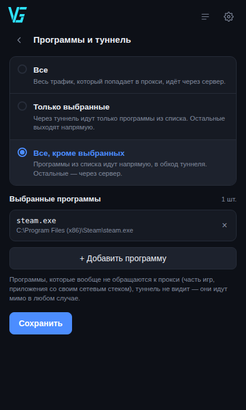

<div align="center">

# ssh_tunel

**Routes application traffic through your own Linux server over plain SSH.**

A single file. No installer, no administrator rights.
An educational project: it shows how a working local proxy is built out of a
standard SSH mechanism.

[](LICENSE)
[](https://github.com/VITAZGIO/ssh_tunel/releases)
[](https://github.com/VITAZGIO/ssh_tunel/releases/latest)
[](https://github.com/VITAZGIO/ssh_tunel/releases/latest)
[](src)

[🇷🇺 Русский](README.md) · 🇬🇧 English

### Download

| System | File | |
|---|---|---|
| **Windows** | [**ssh_tunel.exe**](https://github.com/VITAZGIO/ssh_tunel/releases/latest/download/ssh_tunel.exe) | window with a button, tray icon |
| **Linux** | [**ssh_tunel-linux**](https://github.com/VITAZGIO/ssh_tunel/releases/latest/download/ssh_tunel-linux) | console + web interface, systemd service |

The ARM build and the checksums are on the
[release page](https://github.com/VITAZGIO/ssh_tunel/releases/latest).




</div>

---

## What this is

SSH has a standard feature — forwarding TCP connections (`direct-tcpip`, the
same thing `ssh -D` does). `ssh_tunel` opens an SSH connection to **your** server
and runs a local proxy on top of it: an application talks to a proxy on its own
machine, and the connection to the destination is opened by the server.

Where that is useful: seeing how a service answers from your server's address,
reaching an internal network you already work in over SSH, debugging how an
application behaves through a proxy, giving a program a stable outgoing address.

No third-party servers, no subscriptions, no accounts: all you need is a server
you can log into over SSH.

The project was written for educational purposes — to work out how SOCKS, HTTP
CONNECT, SSH channels and socket-to-process lookup are put together. How you use
it, and whether that agrees with the rules of your provider, of the services you
reach, and with your local law, is your responsibility.

### Key features

- 🔌 **Three protocols at once** — SOCKS5, SOCKS4/4a and HTTP CONNECT. Different
  programs speak different things, and all three are needed.
- 🎯 **Per-application split tunnelling** — everything goes through the tunnel,
  or only the applications you pick, or everything except them. Rules apply on
  the fly, without reconnecting.
- 🏠 **Your LAN stays reachable** — the router, a NAS, Home Assistant and
  anything else on `192.168.x.x` or reachable by a local name goes direct
  instead of through the server. Mesh VPNs (NetBird, Tailscale) too: their
  `100.64.x.x` addresses are covered. Other networks go in your own
  always-direct list.
- 🧩 **Works where the system proxy cannot** — Node.js, Python, Go and everything
  built on them (Claude Code, npm, pip, curl) read only environment variables,
  and the program sets them.
- ♻️ **Survives dropped links** — a pool of SSH connections with liveness checks
  and automatic reconnect. A laptop waking from sleep does not break the tunnel.
- 🛟 **Restores your settings on any exit**, including a crash: the internet does
  not disappear after you quit.
- 🔑 **Verifies the server key** — a man-in-the-middle swapping the server out
  will not pass unnoticed.
- 📈 **Measures the real throughput** — a multi-stream speed test through the
  tunnel.
- 👀 **Shows who is going online** — a live list of programs and addresses, with
  a mark when a DNS lookup went around the tunnel.

> A detailed technical write-up is in [ARCHITECTURE.md](docs/ARCHITECTURE.md)
> (in Russian).

---

## How it works (short version)

```
  application
      │  SOCKS4/4a/5 (1080)   HTTP CONNECT (1081)
      ▼
  ssh_tunel  ──── encrypted SSH (22) ────►  your server  ──►  network
```

1. The application thinks it is talking to an ordinary proxy on its own machine.
2. `ssh_tunel` parses the request, learns the destination and opens a
   `direct-tcpip` channel to it over SSH.
3. Host names are resolved by the server, not by your computer: the connection
   leaves from the server's address in full, DNS lookup included.

---

## Requirements

**Your machine:**
- Windows 10 / 11, or Linux (amd64 / arm64)
- nothing else: the binary is self-contained, no runtime, no installer

**Your server:**
- any Linux server you can reach over SSH — your own box or a rented one, it
  makes no difference. Nothing has to be installed on it: the proxy runs on
  your machine, the server only passes connections through.

Freshly rented server, still stock? Turn password logins off and switch the
firewall on first — a ready-to-paste block of commands is in
[SERVER-SETUP.md](docs/SERVER-SETUP.md) (in Russian).

---

## Windows

1. Download [**ssh_tunel.exe**](https://github.com/VITAZGIO/ssh_tunel/releases/latest/download/ssh_tunel.exe)
   and put it in a permanent folder.
2. Run it. Windows will warn about an unknown publisher — «More info» → «Run
   anyway» (the binary is not signed with a certificate: that costs money and
   requires a legal entity).
3. Open the settings (the gear), enter the server address and the user name.
   No key yet? Click the question mark next to «Private key» — there is a
   ready-made command that creates a key and uploads it to the server.
4. Save, go back, press the round button.

The close button hides the program in the tray, the tunnel keeps running. To
quit for real: right-click the tray icon → «Exit».

If you want a console build for Windows, it is in the sources and takes one
command: `GOOS=windows go build -o ssh_tunel-cli.exe ./cmd/ssh_tunel-cli`.

---

## Linux

For servers and workstations, amd64 and arm64.

```bash
# download and make executable
curl -LO https://github.com/VITAZGIO/ssh_tunel/releases/latest/download/ssh_tunel-linux
chmod +x ssh_tunel-linux

# set the server once
./ssh_tunel-linux -host YOUR_SERVER -user root -save

# run: tunnel only...
./ssh_tunel-linux

# ...or with the web interface
./ssh_tunel-linux -web
```

The web interface is the very same one the Windows build shows in its window,
served on `127.0.0.1:47821`. The port is deliberately unusual so it does not
collide with whatever is already running on a server. The address, together with
an access token, is printed at startup; without the token the interface does not
answer. It does not expose itself to the outside — that needs the separate
`-web-listen` flag, and the program warns you about the risk.

Wire the proxy into the current shell (curl, git, apt, docker, pip, npm):

```bash
source ~/.config/ssh_tunel/proxy.env
```

As a systemd service — see [packaging/linux](packaging/linux):

```bash
./packaging/linux/install.sh ./ssh_tunel-linux
systemctl --user enable --now ssh_tunel
```

---

## Configuration

Settings live in `%APPDATA%\ssh_tunel\config.json` on Windows and in
`~/.config/ssh_tunel/config.json` on Linux. The GUI writes the same file the
flags do.

| Key | Meaning |
|---|---|
| `host` | Address of your server. |
| `sshPort` | SSH port, `22` by default. |
| `user` | User to log in as. |
| `keyPath` | Private key. Detected automatically among `id_ed25519`, `id_ecdsa`, `id_rsa`. |
| `socksPort` | Local SOCKS4/4a/5 port, `1080` by default. |
| `httpPort` | Local HTTP proxy port, `1081` by default. |
| `poolSize` | Number of parallel SSH connections. More streams — higher throughput on a long link. |
| `filterMode` | `all`, `only` or `except` — the split-tunnelling mode. |
| `filterApps` | The list of applications that mode applies to. |
| `localViaTunnel` | Whether the local network goes through the server too. `false` by default — it goes direct. |
| `directHosts` | Your own list of addresses and networks that always go direct: `100.64.0.0/10`, `10.8.*`, `.netbird.cloud`. |

Linux flags: `-host`, `-sshport`, `-user`, `-key`, `-port`, `-httpport`,
`-pool`, `-filter`, `-apps`, `-direct`, `-local-via-tunnel`, `-sysproxy`,
`-setenv`, `-save`, `-env`, `-web`, `-web-listen`, `-v`.

---

## Security

- **The server key is checked.** On the first connection its fingerprint is
  remembered (TOFU) in `known_hosts`; if it changes later, the program refuses
  to connect instead of quietly talking to whoever answered.
- **Host names are resolved on the server**, so the whole request goes through
  the tunnel. Connections that arrive already resolved (the application looked
  the name up itself) are marked in the log: those do not leave entirely via the
  server.
- **The system proxy is restored on every exit**, including a crash — there is a
  saved snapshot and a recovery pass at the next start. Losing the internet
  because a program died is not acceptable.
- **The local web interface is protected by a random token** and an `Origin`
  check, on a random port: an arbitrary page open in your browser must not be
  able to reach `127.0.0.1` and switch the tunnel off or read the settings.
- **No administrator rights.** Everything is written under the current user.

What the program does not do: disguise itself. From the outside it is an
ordinary SSH connection to your server, with exactly the properties an ordinary
SSH connection has — no more, no less. The full picture is in
[SECURITY.md](docs/SECURITY.md) (in Russian).

---

## What the tunnel does not cover

- Programs with their own network stack that ignore both the system proxy and
  the environment variables — some games, some messengers.
- UDP entirely: SSH forwards TCP only. Browsers fall back to TCP by themselves
  when QUIC is unavailable.
- DNS lookups made by applications that resolve names on their own, before they
  ever talk to the proxy. Such connections are marked in the log.
- The local network, deliberately: `192.168.x.x`, `10.x.x.x`, dotless names and
  the `.local`/`.lan`/`.home` suffixes go direct, otherwise your home services
  would stop opening. If you need the opposite — the server's own internal
  network — tick «Локальную сеть тоже вести через сервер» in the settings.

---

## Building from source

Go 1.22 or newer is the only requirement — no C compiler, no external libraries.

```bash
cd src
go test ./... -race     # check that everything works
./build.sh              # build everything into ../releases
```

```
src/          source code (a Go module)
packaging/    systemd service and installer for Linux
docs/         architecture, security, troubleshooting
```

Binaries are not kept in the repository — they are published in
[releases](https://github.com/VITAZGIO/ssh_tunel/releases) so the history does
not swell with megabytes.

---

## Contributing

Pull requests and issues are welcome. Please do not commit personal data (server
addresses, keys, `config.json`, `known_hosts`) — they are already in
`.gitignore`.

## License

[MIT](LICENSE) © 2026 Vitaliy ([VITAZGIO](https://github.com/VITAZGIO)).
Developed together with Claude (Anthropic).
