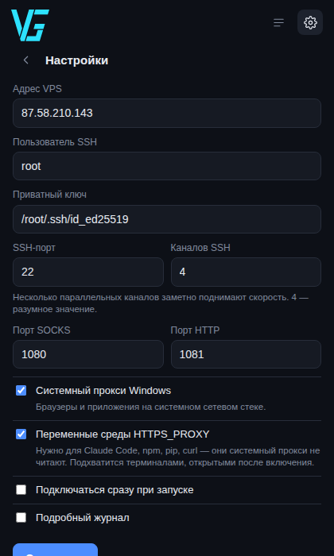

# ssh_tunel

Один exe для Windows, который гонит трафик через SSH-туннель до собственного
VPS. Без установки, без внешних `ssh.exe`/PuTTY, без прав администратора.

Провайдер видит только факт SSH-соединения с сервером за границей — не
содержимое и не список сайтов. В отличие от WireGuard и OpenVPN, у SSH нет
характерной сигнатуры, по которой его выключают массово: это рабочий инструмент,
которым каждый день пользуются администраторы и разработчики.

<p align="center">
  
  
</p>

## Что умеет

- **Обычное приложение Windows** — своя иконка, место в панели задач, Alt+Tab.
  Одна большая кнопка подключения, настройки за шестерёнкой.
- **Прячется в трей** — крестик не обрывает туннель, а сворачивает окно к
  часам. Оттуда же можно отключиться, не открывая окно.
- **Видно, кто ходит в интернет** — живой список: какая программа, куда, с
  пометкой, если её DNS-запрос ушёл мимо туннеля.
- **Три протокола сразу** — SOCKS5, SOCKS4/4a и HTTP CONNECT. Разные программы
  умеют разное, и нужны все три.
- **Чинит 403 в Claude Code** — прописывает `HTTPS_PROXY`, который читают
  Node.js, Python и Go. Системный прокси Windows они игнорируют.
  См. [TROUBLESHOOTING.md](docs/TROUBLESHOOTING.md).
- **Переживает обрывы связи** — пул SSH-соединений с keepalive и
  переподключением. Заснувший ноутбук больше не ломает туннель.
- **Возвращает настройки как было** — при любом закрытии, включая крестик и
  аварийное завершение. Интернет после выхода не пропадает.
- **Проверяет ключ сервера** — вместо прежнего «доверять чему угодно».
- **Разделяет трафик по программам** — можно вести через туннель всё, только
  выбранные приложения, или всё кроме выбранных. Правила меняются на ходу.
- **Меряет реальную скорость** — кнопка теста качает данные через туннель в
  несколько потоков и показывает приём и отдачу.

## Быстрый старт

1. Скачай `ssh_tunel.exe` из папки [releases](releases/).
2. Запусти двойным щелчком — откроется окно.
3. Открой настройки (шестерёнка справа сверху), проверь адрес VPS,
   пользователя и путь к приватному ключу. Нажми «Сохранить» и вернись назад.
4. Нажми большую круглую кнопку.
5. Нажми «проверить» рядом с внешним IP — должен показать адрес VPS.

Дальше браузеры и большинство программ работают через туннель сами.

Закрытие окна крестиком не отключает туннель — программа уходит в трей.
Чтобы выйти совсем, щёлкни правой кнопкой по значку у часов → «Выход».

**Для Claude Code, npm, pip и прочего не-Microsoft**: после включения туннеля
закрой и заново открой терминал — переменные среды подхватываются только новыми
процессами.

## Консольная версия

Если больше нравятся команды, есть `ssh_tunel-cli.exe`:

```powershell
.\ssh_tunel-cli.exe -host 87.58.210.143 -user root -key C:\Users\vitaz\.ssh\id_ed25519 -save
```

Флаг `-save` запоминает настройки — дальше достаточно просто `.\ssh_tunel-cli.exe`.
Полный список флагов: `.\ssh_tunel-cli.exe` без аргументов.

Лог теперь компактный, по строке на соединение:

```
00:26:48  msedge.exe         → www.youtube.com:443
00:26:50  node.exe           → api.anthropic.com:443
00:26:51  Discord.exe        → 162.159.128.233:443   DNS мимо туннеля
00:26:52  steam.exe          → store.steampowered.com:443   мимо туннеля (по правилам)
```

Фильтр по программам есть и здесь:

```powershell
.\ssh_tunel-cli.exe -filter except -apps steam.exe,discord.exe
```

## Сборка из исходников

Нужен Go 1.22 или новее.

```bash
cd src
go test ./... -race                      # проверить, что всё работает
./build.sh                               # собрать оба exe в ../releases
```

Или вручную:

```bash
cd src
GOOS=windows GOARCH=amd64 go build -ldflags="-s -w -H windowsgui" -o ssh_tunel.exe ./cmd/ssh_tunel
GOOS=windows GOARCH=amd64 go build -ldflags="-s -w" -o ssh_tunel-cli.exe ./cmd/ssh_tunel-cli
```

## Что где лежит

```
src/         исходный код (модуль Go)
releases/    готовые exe
docs/        как устроено, что видно провайдеру, что делать при проблемах
```

## Документация

- [Как это устроено](docs/ARCHITECTURE.md) — схема, пул соединений, почему две
  точки входа
- [Что видно со стороны](docs/SECURITY.md) — что видит провайдер и ТСПУ,
  утечки DNS, проверка ключа сервера
- [Что делать, когда не работает](docs/TROUBLESHOOTING.md) — 403 в Claude Code,
  пропавший интернет, скорость

## Чего туннель не покрывает

- Программы со своим сетевым стеком, игнорирующие и системный прокси, и
  переменные среды (часть игр, некоторые мессенджеры).
- UDP целиком — SSH пробрасывает только TCP. Браузеры при недоступности QUIC
  откатываются на TCP сами.
